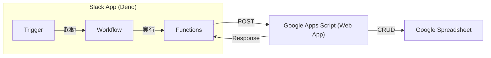

# LibraryBot (書籍管理ボット)

社内ライブラリの書籍管理を行うSlackアプリです。
Slackの次世代プラットフォーム（Deno）で構築されており、バックエンド（データベース）としてGoogle Apps Script (GAS) と Google Sheetsを利用しています。

## 機能概要

*   **書籍の貸出 (Borrow):** `/borrow` 書籍を検索し、貸出処理を行います。
*   **書籍の返却 (Return):** `/return` 借りている書籍を返却します。
*   **購入リクエスト (Purchase Request):** `/request` 新しい書籍の購入を依頼します。
*   **蔵書登録 (Shelve):** `/shelve` 新しい書籍を管理シートに登録します。
*   **リマインド (Remind):** 返却期限のリマインドを行います。
*   **マスタデータ更新 (Master Data):** ユーザー情報の更新などを行います。

## 構成図

## セットアップ手順

### 1. 前提条件

*   Slack CLI がインストールされていること (`curl -fsSL https://downloads.slack-edge.com/slack-cli/install.sh | bash` )
*   Deno がインストールされていること (`curl -fsSL https://deno.land/install.sh | sh`)
*   Slack ワークスペースへのアプリインストール権限があること
*   バックエンドとなる Google Apps Script (GAS) がデプロイされており、その Web App URL が取得済みであること

    **取得手順**: 管理シート→拡張機能タブ→Apps Scriptを開く→デプロイ→新しいデプロイorデプロイを管理→ウェブアプリURL


### 2. Slack CLIの認証

Slack CLI を使用するために、Slack ワークスペースへの認証が必要です。以下のコマンドを実行してください。

```bash
slack login
```
```bash
$ slack login

📋 Run the following slash command in any Slack channel or DM
   This will open a modal with user permissions for you to approve
   Once approved, a challenge code will be generated in Slack

/slackauthticket ABC123defABC123defABC123defABC123defXYZ  // このコマンドをワークスペースの任意チャンネルで送信。開発時はSandboxのワークスペースを使用。

? Enter challenge code
```
```bash
? Enter challenge code eXaMpLeCoDe // チャンネルで返してくれたコードを入力

✅ You've successfully authenticated! 🎉
   Authorization data was saved to ~/.slack/credentials.json

💡 Get started by creating a new app with slack create my-app
   Explore the details of available commands with slack help
```
### 3. プロジェクトの準備

```bash
# 依存関係の解決
slack doctor
```


### 4. 環境変数の設定

Google Apps Script のウェブアプリ URL を環境変数 `GAS_URL` として設定する必要があります。

```bash
slack env add GAS_URL https://script.google.com/macros/s/xxxxxxxxx/exec
slack env add CHANNEL_ID {メッセージをプッシュしたいチャンネルID}
slack env add CHANNEL_FOR_GET_MEMBERS {利用者を取得するためのチャンネルID}(CHANNEL_IDに利用者全員が入っていればCHANNEL_IDを流用)
```

### 5. アプリのデプロイ

```bash
slack deploy
```

### 6. トリガーの作成

各機能を利用するためのトリガー（ショートカット等）を作成します。以下のコマンドを実行してください。

```bash
slack trigger create --trigger-def "./triggers/borrow_trigger.ts"
slack trigger create --trigger-def "./triggers/return_trigger.ts"
slack trigger create --trigger-def "./triggers/purchase_request_trigger.ts"
slack trigger create --trigger-def "./triggers/shelve_trigger.ts"
slack trigger create --trigger-def "./triggers/remind_trigger.ts"
slack trigger create --trigger-def "./triggers/master_data_trigger.ts"
```

コマンド実行後に表示されるショートカットURLをSlackのブックマーク等に登録して利用できます。

## ローカル開発

ローカルで動作確認を行う場合は以下のコマンドを実行します。

```bash
slack run
```

注意: ローカル実行時用の環境変数設定が必要な場合は、`.env` ファイルを作成するか、`slack env add` でローカル環境 (`slack env add GAS_URL ...`) にも変数を設定してください。(どちらでも良いです)

## Q&A

##### Q: なぜdeno Slack SDKを採用したのか
A: *主にslack次世代プラットフォーム(slack公式のマネージドホスティングサービス)を利用するためです。このプラットフォームは現在`deno Slack SDK`で作成したアプリしかサポートしていません。これを利用することで、アプリのホスティングやデプロイを簡素化できます。*

##### Q: なぜDataStoreを使わなかったのか
A: *使ってもいいものですが、現存のシートもそのまま運用したいという観点で、DataStoreではなくGoogle SheetをDB代わりに使いました。また、DataStoreをシートのレプリカとして使おうかとも思いましたが、複雑性が増すほか費用対効果も低いため採用しませんでした。*

##### Q: なぜGoogle Sheetの処理をアプリ内ではなく、AppsScriptに移行したのか
A: *最初は`googleapis`というライブラリを使用しました。が、`googleapis`は真っ先に.envファイルを読み込む特性を持ちます。*
*denoアプリを実行する際に`--allow-env`オプションを指定しない限り、環境変数を有効化できません。*
*slackのマネージド環境は素の`deno run` コマンドでアプリを起動しているため、ライブラリは環境変数を読め込めず起動が一生失敗します。*
*よって、シート操作処理をApps Scriptへ移行し、アプリはそのAPIを呼び出す形にしました。*

##### Q: アプリをワークスペースにインストールする際に、どの権限を必要としますか？
A: *アプリをワークスペースにインストールする際には、アプリに以下の権限が必要です。*
   - *`chat:write`：ボットがチャンネルにメッセージを投稿するための権限*
   - *`commands`：ボットが `/borrow`, `/return`, `/request`, `/shelve`, `/remind`, `/masterdata` コマンドを認識するための権限*
   - *`users:read`：ボットがユーザー情報を取得するための権限*
   - *`channels:read`：ボットがチャンネル情報を取得するための権限*

##### Q: シートの仕様やレイアウト変更に対するロバスト性はあるのか？
A: *ほぼ皆無です。*
*Google SheetでCRUD操作を実現するために、泥臭く1行1列を絞り込んだり、検索・更新・削除・追加したりしています。*
*シートの仕様やレイアウト変更が発生した場合、正常動作のためにAppsScript側での大量修正が必要になります。*
